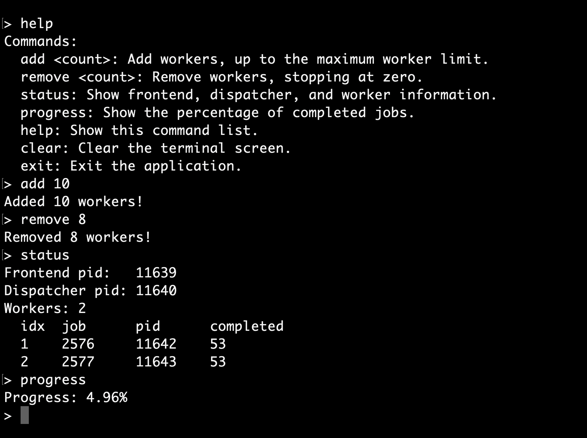
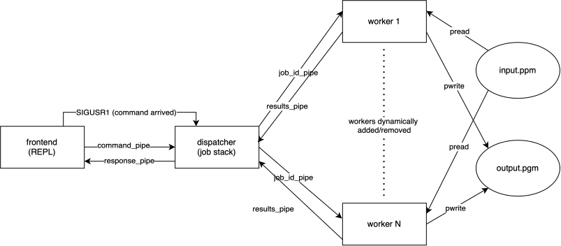

# Parallel Image Processor

A worker-pool-based system for parallel image transformations in C, using `fork()`/`exec()`, Unix pipes, signals, and a REPL-driven frontend.

  

## Architecture

Work is distributed across three types of processes:

* **Frontend** — provides the interactive REPL, parses user commands, and sends requests to the dispatcher through pipes and `SIGUSR1`. It remains blocked waiting for user input when idle.

* **Dispatcher** — divides the image into jobs, maintains the job stack, dynamically creates and removes workers, assigns jobs, and executes commands received from the frontend. It also detects failed workers, requeues unfinished jobs, and spawns replacements.

* **Worker** — receives job IDs from the dispatcher, uses `pread()` to read the assigned region of the input image, processes the pixels, and uses `pwrite()` to write the result to the corresponding region of the output image.

  

